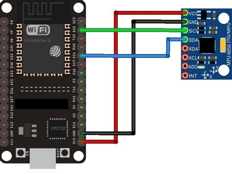

# 📌 Sistema de Monitoramento e Análise Preditiva para Manutenção Industrial

## 🔍 Objetivo

Desenvolver um sistema avançado de detecção de anomalias em maquinários industriais, utilizando Machine Learning e sensores IoT. O sistema será capaz de identificar e prever falhas operacionais com base na análise contínua de dados de temperatura, vibração, umidade e consumo de energia, permitindo a implementação de estratégias de manutenção preditiva para otimização do desempenho industrial.

## ⚠️ Problema a Ser Resolvido

Atualmente, a manutenção de máquinas industriais enfrenta desafios como:

- **Falhas inesperadas 🛑**: Paradas não planejadas impactam a produtividade e aumentam custos operacionais.
- **Alto custo de manutenção corretiva 💰**: Reparos emergenciais exigem maior investimento e reduzem a vida útil dos equipamentos.
- **Dificuldade na identificação de padrões de anomalia 🔍**: Sensores coletam grandes volumes de dados, mas a análise manual é lenta e imprecisa.
- **Falta de previsibilidade 📉**: Empresas não conseguem antecipar falhas antes que impactem a operação.

## 🏆 Solução Proposta

Nosso sistema proporciona uma abordagem baseada em inteligência artificial e análise estatística, permitindo:

- ✅ **Monitoramento contínuo** dos equipamentos em tempo real.
- ✅ **Detecção automática** de anomalias utilizando o modelo Mahalanobis.
- ✅ **Predição de falhas** com base em padrões históricos.
- ✅ **Redução de custos operacionais** ao permitir manutenções planejadas.
- ✅ **Integração flexível** com sistemas IoT para aquisição e processamento de dados.

## 🚀 Tecnologias Utilizadas

- **Backend**: FastAPI para a API de análise preditiva.
- **Machine Learning**: Algoritmo de distância de Mahalanobis para detecção de anomalias.
- **Infraestrutura**: Docker para containerização e implantação eficiente.
- **Sensores IoT**: Coleta de dados de temperatura, vibração e consumo de energia.

---

## 🎯 Principais Componentes

- **Sensores IoT**: Dispositivos para aquisição de variáveis ambientais e operacionais (temperatura, vibração, umidade, consumo energético).
- **Plataforma de Coleta de Dados**: Middleware responsável pela captura, armazenamento e processamento dos dados.
- **Machine Learning**: Modelos treinados para identificar padrões anômalos e prever falhas futuras.
- **Interface Web/Dashboard**: Plataforma interativa para monitoramento em tempo real, alertas de anomalias e geração de relatórios.

---

## 🔬 Estratégia de Coleta e Treinamento de Dados

1. **Fase Inicial - Coleta de Dados Normais**
   - Registrar dados operacionais de equipamentos em condições normais.
   - Determinar padrões estatísticos para definir um estado de referência.

2. **Simulação de Anomalias**
   - Induzir e registrar comportamentos anômalos.
   - Capturar dados de erro para compor um dataset robusto e representativo.

3. **Treinamento do Modelo**
   - Utilizar os dados coletados para treinar algoritmos supervisionados e não supervisionados.
   - Implementar técnicas como *Random Forest, SVM, LSTMs* e *Autoencoders*.

---

## ⚡ Primeiros Testes e Infraestrutura

- Utilização de um **acelerômetro de 3 eixos** para análise de vibração mecânica.
- Conectividade inicial via **ESP8266** (Wi-Fi) para transmissão de dados.
- Implementação de um pipeline de dados para análise em tempo real.
- Avaliação de protocolos de comunicação alternativos, como **BLE, Zigbee e LoRaWAN**, para maior escalabilidade.

---

## 📌 Etapas do Projeto

1. **Replicar Sensores**
   - Escolher sensores IoT para coleta de temperatura, vibração e umidade.
   - Integrar sensores com microcontroladores (ESP32, Raspberry Pi, Arduino).
   - Estabelecer comunicação via MQTT, LoRaWAN ou outro protocolo adequado.

2. **Coletar Dados**
   - Definir a frequência e o formato de coleta.
   - Armazenar dados em bancos de dados adequados (InfluxDB, PostgreSQL, MongoDB).
   - Criar uma API para comunicação entre sensores e o banco de dados.

3. **Tratar Dados**
   - Limpar e organizar os dados coletados.
   - Normalizar e padronizar valores para melhorar a qualidade dos dados.
   - Aplicar filtros para remoção de ruídos (média móvel, FFT para vibração).

4. **Extrair Features**
   - Identificar padrões e variáveis relevantes.
   - Criar novas variáveis derivadas para aprimorar a análise.
   - Utilizar algoritmos de seleção de features (PCA, ANOVA, correlação).

5. **Treinar o Modelo**
   - Escolher o algoritmo mais adequado (Random Forest, SVM, Redes Neurais, LSTMs).
   - Treinar os modelos com os dados tratados.
   - Testar diferentes abordagens para otimização de desempenho.

6. **Validar**
   - Testar o modelo com novos dados.
   - Ajustar hiperparâmetros para melhorar a precisão.
   - Implementar o modelo na plataforma de monitoramento.

---

## 🛠 Tecnologias Utilizadas

- **Sensores**: MPU6050 (vibração), DHT22 (umidade), MLX90614 (temperatura), ACS712 (corrente elétrica).
- **Microcontroladores**: ESP32, Raspberry Pi.
- **Protocolos de Comunicação**: MQTT, LoRaWAN.
- **Bancos de Dados**: InfluxDB (time series), PostgreSQL/MongoDB.
- **Linguagens**: Python (ML e processamento de dados), C++/MicroPython (IoT).
- **Bibliotecas de Machine Learning**: Scikit-learn, TensorFlow, PyCaret.
- **Frameworks para Dashboard**: Streamlit, Grafana, Flask/Django.
---
- **Diagrama**:
- 

## 📚 Referências

### Principais Fontes

1. [Anomaly Detection in Industrial Machinery using IoT Devices and Machine Learning: a Systematic Mapping](https://arxiv.org/abs/2307.15807)
2. [Predictive Maintenance Model Based on Anomaly Detection in Induction Motors: A Machine Learning Approach Using Real-Time IoT Data](https://arxiv.org/abs/2310.14949)
3. [Deep Anomaly Detection for Time-series Data in Industrial IoT: A Communication-Efficient On-device Federated Learning Approach](https://arxiv.org/abs/2007.09712)
4. [Detecção de anomalias de posicionamento em robôs industriais utilizando aprendizado de máquina](https://repositorio.utfpr.edu.br/jspui/bitstream/1/33991/1/deteccaoanomaliasrobos.pdf)
5. [Detecção de anomalias em aprendizado de máquina - IBM](https://www.ibm.com/br-pt/think/topics/machine-learning-for-anomaly-detection)

### Fontes Adicionais

- [Levantamento Bibliográfico e Revisão da Literatura sobre Modelos de Detecção de Anomalias em Redes IoT com o Uso de Machine Learning](https://www.fateccruzeiro.edu.br/revista/index.php/htec/article/download/432/293/)
- [Métodos de Inteligência Artificial para Detecção de Falhas Industriais: Uma Análise Comparativa](https://repositorio.utfpr.edu.br/jspui/bitstream/1/34290/1/metodosinteligenciaartificialdeteccaofalhasindustriais.pdf)
- [Estudo da Aplicação de Algoritmos de Machine Learning na Manutenção Preditiva de Motores Elétricos](https://www.researchgate.net/publication/374455039_Estudo_da_aplicacao_de_algoritmos_de_machine_learning_na_manutencao_preditiva_de_motores_eletricos)
- [Aplicação de Sensor Virtual Baseado em Aprendizado de Máquina para Aprimoramento da Eficiência Global em Manufatura Digital](https://repositorio.unifesp.br/bitstream/handle/11600/69541/Aplicacao%20de%20Sensor%20Virtual%20baseado%20em%20Aprendizado%20de%20Maquina%20para%20Aprimoramento%20da%20Eficiencia%20Global%20em%20Manufatura%20Digital.pdf?isAllowed=y&sequence=1)
- [Modelos de Aprendizado de Máquina para Detecção de Anomalias no Processo de Manufatura de Pneus](https://www.researchgate.net/publication/375056960_MODELOS_DE_APRENDIZADO_DE_MAQUINA_PARA_DETECCAO_DE_ANOMALIAS_NO_PROCESSO_DE_MANUFATURA_DE_PNEUS)
- [Inteligência Artificial para Detectar Avarias em Motores Elétricos](https://cadenaser.com/comunitat-valenciana/2024/10/11/inteligencia-artificial-para-detectar-averias-en-motores-electricos/)

### Sensores e Hardware

- [Sensor de poeira e fumaça DSM501A](https://www.manualdomaker.com/article/sensor-de-poeira-e-fumaca-dsm501a/)
- [MPU-6000 Datasheet](https://d229kd5ey79jzj.cloudfront.net/974/MPU-6000-Datasheet1.pdf)
- [Termistor NTC 100k 3950 com cabo e conector Dupont](https://www.bluemakers.com.br/suprimentos/termistor-ntc-100k-3950-cabo-1m-conector-dupont/)

---

## 📜 Licença

Este projeto está licenciado sob a **MIT License** – veja o arquivo [LICENSE](LICENSE) para mais detalhes.
